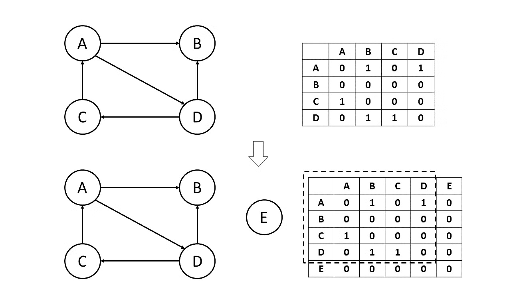
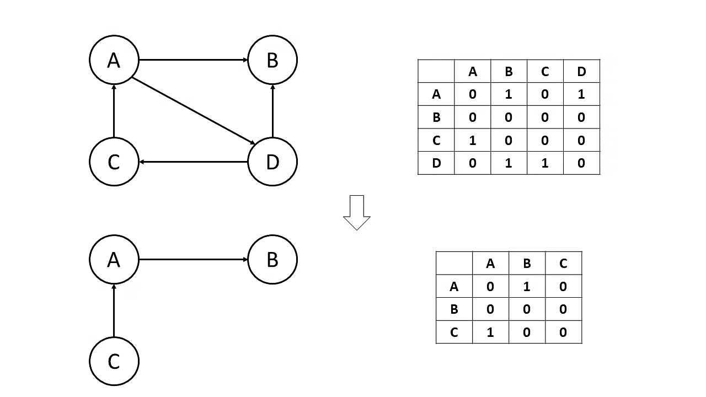
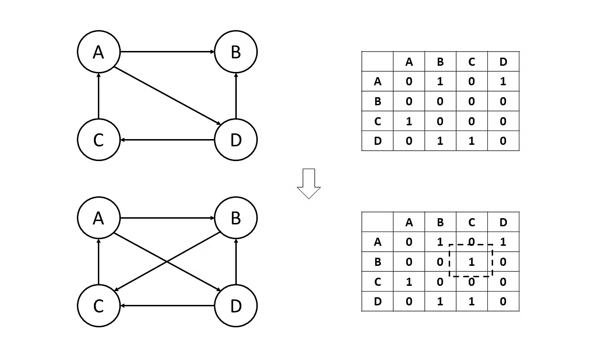

## Methods of the AdjancencyList

- Insert Vertex
- Insert/remove Edge
- Remove Vertex

## Implementation

Using a `Dictionary` that containes a Node as a key and another Dictionary that contains every other Node in the Dictionary followed by their Edge (or value)

### Insert a Vertex

A new **Dictionary that contains the new Vertex and a dictionary with all the other Vertex** is created, if connections are not specified they will set it as null

```csharp
        public Node InsertVertex(Node node, List<Node>? connections = null)
        {
            if (Matrix.ContainsKey(node))
            {
                // If already has that Vertex we make update them connections/edges
#if UNITY_EDITOR
                Debug.LogWarning($"Node {node.Name} already exists in the graph, it will be updated.");
#else
                Console.WriteLine($"Node {node.Name} already exists in the graph, it will be updated.");
#endif
                if (connections != null) InsertEdge(node, connections.ToArray());
                return node;
            }

            if (connections == null)
            {
                connections = new List<Node>();
            }

            var newConnections = new Dictionary<Node, bool>();

            // For each node already in graph, we add it to the Edges Values, if is not specified in connections, the edge will be false
            foreach (var nodes in Matrix.Keys)
            {
                newConnections[nodes] = connections.Contains(nodes) ? true : false;
                Matrix[nodes][node] = false;
            }

            // Add the last edge at the matrix (its own edge)
            newConnections[node] = false;
            Matrix.Add(node, newConnections);

            return node;
        }
```

> 

### Remove Vertex

Search for all edges the others vertex and remove that edges, then, remove the Vertex

```csharp
public void RemoveVertex(Node vertex)
{
  if (!Matrix.ContainsKey(vertex)) return;
  foreach (var edges in Matrix.Values)
  {
    edges.Remove(vertex);
  }
  Matrix.Remove(vertex);
}
```

> 

### Add / Remove Edge

Edges are always "saved" but they have a value that indicates if it exists or not.

```csharp
public void InsertEdge(Node from, Node to, bool disconnect = false)
{
    if (!Matrix.ContainsKey(from)) InsertVertex(from);
    if (!Matrix.ContainsKey(to)) InsertVertex(to);
    Matrix[from][to] = disconnect ? false : true;
}
```

> 

## Benchmarks

I use `BenchmarkDotNet` to run the benchmarks and the results are showed in the table below

| Method                                       |      Mean |    Error |   StdDev |
| -------------------------------------------- | --------: | -------: | -------: |
| Benchmark_InsertEdge                         |  60.73 ns | 0.188 ns | 0.166 ns |
| Benchmark_RemoveVertex                       |  11.50 ns | 0.151 ns | 0.134 ns |
| Benchmark_AddVertex                          |  18.66 ns | 0.079 ns | 0.066 ns |
| Benchmark_AddingMultipleEdges                | 191.62 ns | 1.058 ns | 0.884 ns |
| Benchmark_AddVertex_SpecifingEdges           | 224.14 ns | 1.568 ns | 1.309 ns |
| Benchmark_AddVertex_SpecifingEdges_newMethod | 246.32 ns | 0.991 ns | 0.878 ns |

### Benchmark environment

```csharp
using BenchmarkDotNet.Attributes;

namespace Topacai_Graphs
{
    public class AdjacencyListBenchmark
    {
        private AdjacencyList adjacencyList;
        private Node a, b, c, d, e, f;

        private List<Node> conjuntOne;

        public AdjacencyListBenchmark()
        {
            adjacencyList = new AdjacencyList();
            a = adjacencyList.InsertVertex(new Node("A"));
            b = adjacencyList.InsertVertex(new Node("B"));
            c = adjacencyList.InsertVertex(new Node("C"));
            d = adjacencyList.InsertVertex(new Node("d"));
            e = adjacencyList.InsertVertex(new Node("e"));
            f = adjacencyList.InsertVertex(new Node("f"));

            conjuntOne = new List<Node>() { c, e, f };
        }

        [Benchmark]
        public void Benchmark_InsertEdge()
        {
            adjacencyList.InsertEdge(a, b);
        }

        [Benchmark]
        public void Benchmark_RemoveVertex()
        {
            adjacencyList.RemoveVertex(a);
        }

        [Benchmark]
        public void Benchmark_AddVertex()
        {
            adjacencyList.InsertVertex(a);
        }

        [Benchmark]
        public void Benchmark_AddVertex_SpecifingEdges()
        {
            adjacencyList.InsertVertex(d, conjuntOne);
        }

        [Benchmark]
        public void Benchmark_AddVertex_SpecifingEdges_newMethod()
        {
            adjacencyList.InsertVertex_new(d, c, e, f);
        }
    }
}
```
