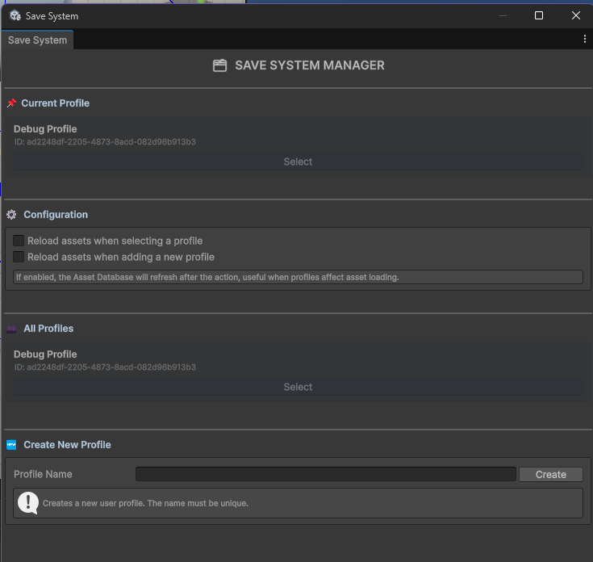

> Documentation during development

The save system provides logic to handle persistent data of the game through sessions or scene changes, the data could be saved separated into different user profiles (if u like to add multiple save games into your game) or just use low level logic to save global data.

The system is separated into two core parts:

- low level manager `SaveDataManager` that provides methods for save and get `objects` serialized data conserving their original type using `TypeNameHandling.Objects` to deserialize it with allowing u to use polymorphism on saved data.
- High level API `SaveSystemClass` that controls the data using a profile and simple methods to save data into profile or level-specific scope.

---

## Usage

On unity editor, you can select an profile from **TopacaiTools -> SaveSystem**

When a profile is selected here or via script, [[SaveSystemClass]] will emit an event even if the playmode is on editor, you can use this to perform scene or assets changes during development.

That is the logic used by `PersistentObjects` and [[PersistentProfileDataSO]]

> [!info] SaveSystemClass
> Saving data operations should be done through [[SaveSystemClass]] class to ensure always there is a profile to save data and it matches with the selected profile on editor or game.
